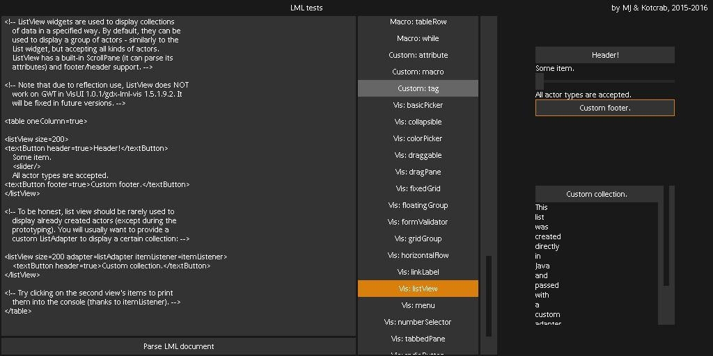

# *Tixel* VisUI skin

See [Tinted](../tinted) skin. This skin follows the same principles, but tries to use a pixel-art(*-ish*) style to achieve scalability. Uses a different font and slightly modified (converted) icons.

I'm no pixel artist, so don't be surprised if some images do not looks super-crispy. Treat this as a (solid?) base for pixel-art GUI skin. Looks great when used with `ScreenViewport` and scaled by `X1, X2, X3` (and so on) when needed.

### Compatibility

The raw assets were taken from `1.3.0` **VisUI** version. Create an issue or pull request if anything is not working or missing.

## License

Same as the **VisUI** library. As far as the author of this skin is concerned, you can do whatever the hell you want with these assets, as long as you don't use them to murder people. He would, however, like to see you try murdering people with images or JSON files.

The attached screenshot is from [`gdx-lml-vis-tests` project](https://github.com/czyzby/gdx-lml/tree/master/examples/gdx-lml-vis-tests) (note: with some paddings adjusted).

***[MJ 2016](https://github.com/czyzby/gdx-lml)***
